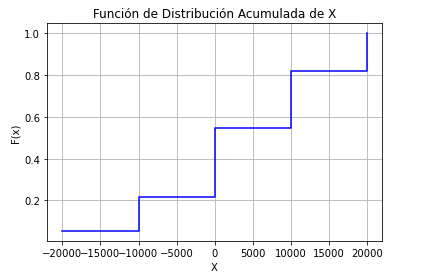

# Clase 27-08-24

## Ejercicio 1
Se tiene una urna con 3 sobres blancos, 3 sobres rojos y 5 negros.
Se sacan 2 sobres. Cada vez que sale un sobre negro se ganan $10000 y cada
vez que sale un sobre rojo se pierden $10000. Los blancos no tienen valor. Sea
$X =$ "ganancia obtenida".

(a) ¿Cuál es la probabilidad putual de $X$ , la función de distribución acumulada de $X$ y su gráfico?

> El rango de $X$ es $R_X = \{ -20000, -10000, 0, 10000, 20000\}$
>
> Probabilidades puntuales de $X$:
>
> $$p_X(-20000)= \frac{\binom{3}{2}}{\binom{11}{2}} = \frac{3}{55} = 0.0545$$
>
> $$p_X(-10000)= \frac{\binom{3}{1} * \binom{3}{1}}{\binom{11}{2}} = \frac{9}{55} = 0.1636$$
>
> $$p_X(0)= \frac{\binom{3}{2}}{\binom{11}{2}} + 2 * \frac{\binom{5}{1} * \binom{3}{1}}{\binom{11}{2}} = \frac{3}{55} + \frac{15}{55}= 0.3272$$
>
> $$p_X(10000)= \frac{\binom{5}{1} * \binom{3}{1}}{\binom{11}{2}} = \frac{15}{55} = 0.2727$$
>
> $$p_X(20000)= \frac{\binom{5}{2}}{\binom{11}{2}} = \frac{10}{55} = 0.1818$$

> Función distribución acumulada:
>
> - $F_X(-20000) =  0.0545$
> - $F_X(-10000) =  0.2181$
> - $F_X(0) = 0.5453$
> - $F_X(10000) = 0.818$
> - $F_X(20000) =  1$

(b) ¿Cuál es la probabilidad de tener ganancia en el juego?

> $P(X > 0) = 1 - F_X(X \leq 0) = 1 - F_X(0) = 1-0.5453 = 0.4547$

## Ejercicio 2
La función de distribución de una v.a X que toma los valores {−1, 1, 2, 3} es ([ver enunciado](https://github.com/malei-dc/PyE/blob/main/Practicas/04-v_a_discretas_y_esperanza.pdf))

(a) Hallar la función de probabilidad puntual.

> $$p_X(-1) = F_X(-1) - F_X(-1^-)= 0.4 - 0 = 0.4$$
>
> $$p_X(1) = F_X(1) - F_X(-1)= 0.5 - 0.4 = 0.1$$
>
> $$p_X(2) = F_X(2) - F_X(1)= 0.8 - 0.5 = 0.3$$
>
> $$p_X(3) = F_X(3) - F_X(2)= 0.1 - 0.8 = 0.2$$

(b) Calcular: $P(0,5 < X < 2,3)$ y $P(X ≤ 2,7|X ≥ 0)$

> $P(0,5 < X < 2,3) = P(1 \leq X \leq 2) = p_X(1) + p_X(2) = 0.1 + 0.3 = 0.4$
>
> $P(X \leq 2,7|X \geq 0) = \frac{P(X \leq 2,7 \cap X \geq 0)}{P(X \geq 0)} = \frac{P(0 \leq X \leq 2,7)}{P(X \geq 0)} = \frac{P(1 \leq X \leq 2)}{1 - P(X < 0)} = \frac{p_X(1) + p_X(2)}{1 - p_X(-1)} = \frac{0.4}{1- 0.4} = 0.6666$

## Ejercicio 3
En un depósito hay 15 discos externos de igual memoria. Se sabe que hay tres fallados pero no se sabe cuáles. Una escuela compra dos al azar. Calcular la función de probabilidad puntual y de distribución acumulada asociadas a adquirir discos defectusos.

> Sea $X$: "adquirir discos defectusos", como la escuela compra 2, sabemos que el $R_X = 0, 1, 2$.
>
> Las funciones puntuales son:
>
> $$p_X(0) = \frac{\binom{3}{0} * \binom{12}{2}}{\binom{15}{2}} = \frac{1 * 66}{105} = 0.6285$$
> 
> $$p_X(1) = \frac{\binom{3}{1} * \binom{12}{1}}{\binom{15}{2}} = \frac{3 * 12}{105} = 0.3428$$
>
> $$p_X(2) = \frac{\binom{3}{2} * \binom{12}{0}}{\binom{15}{2}} = \frac{3 * 1}{105} = 0.0287$$
>
> La función distribución acumulada es:
>
> - Si $x < 0 \rightarrow F_X(x) = P(X \leq x) = 0$
> - Si $x = 0 \rightarrow F_X(0) = P(X \leq 0) = p_X(0) = 0.6285$
> - Si $0 < x < 1 \rightarrow F_X(x) = P(X \leq x) = p_X(0) = 0.6285$
> - Si $x = 1 \rightarrow F_X(1) = P(X \leq 1) = p_X(0) + p_X(1) = 0.6285 + 0.3428 = 0.9713$
> - Si $1 < x < 2 \rightarrow F_X(x) = P(X \leq x) = p_X(0) + p_X(1) = 0.6285 + 0.3428 = 0.9713$ 
> - Si $x = 2 \rightarrow F_X(2) = P(X \leq 2) = p_X(0) + p_X(1) + p_X(2) = 0.6285 + 0.3428 + 0.0287 = 1$
> - Si $x > 2 \rightarrow F_X(x) = P(X \leq 2) = p_X(0) + p_X(1) + p_X(2) = 0.6285 + 0.3428 + 0.0287 = 1$

> DATO: más adelante veremos que esta variable aleatoria es una hipergeométrica.

## Ejercicio 4
La v.a. X está distribuida según la siguiente probabilidad puntual

| X | 1 | 2 | 3 | 4 | 5 |
|:---------:|:-----------:|:-----------:|:-----------:|:-----------:|:-----------:|
| $P(X=x)$ | 0.3 | 0.1 | 0.25 | 0.25 | 0.1 |

Calcular la funcion de probabilidad acumulada de $X$ y $E(X)$. Hallar la $E(Y)$ y $E(Z)$ donde $Y = 3X − 1$ y $Z = \frac{1}{X}$

> $$E(X) = \sum_{x \in R_X} x * p_X(x) = 1 * 0.3 + 2 * 0.1 + 3 * 0.25 + 4 * 0.25 + 5 * 0.1 = 2.75$$
>
> $$E(Y) = E(3X - 1) = \sum_{x \in R_X} (3x-1) * p_X(x) = \sum_{x \in R_X} (3x * p_X(x) - 1 * p_X(x)) = \sum_{x \in R_X}3x * p_X (x) - \sum_{x \in R_X} 1 * p_X(x) = 3 * E(X) - 1 * 1 = 7.25$$
>
> $$E(Z) = E(\frac{1}{X}) = \sum_{x \in R_X} \frac{1}{x} * p_X(x) = \frac{1}{1} * 0.3 + \frac{1}{2} * 0.1 + \frac{1}{3} * 0.25 + \frac{1}{4} * 0.25 + \frac{1}{5} * 0.1 = 0.5158$$